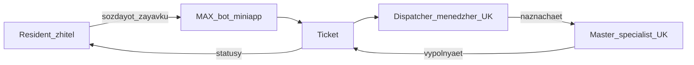

# Smart City MVP — заявки в УК (MAX)

Цифровой канал в мессенджере **MAX** (чат-бот + мини-приложение на **MAX UI**): житель через **Guided Reporting** регистрирует обращение по своему дому, сразу получает первичную рекомендацию «до приезда мастера», заявка с **urgency** попадает диспетчеру УК → назначение мастера → закрытие.

> Данные модельные (ГИС/УК): вымышленные организации, дома и специалисты для демо. Живого ГИС нет.

---

## Формулировка проблемы

**Житель МКД** при аварии или поломке хочет быстро зафиксировать обращение по своему дому и понять, что делать сразу, но не знает порядок действий и не видит статус — из‑за этого растут звонки и повторные обращения.

Продукт в MAX ведёт Guided Reporting (адрес → блок → вопросы), регистрирует заявку в нужную УК с учётом срочности, даёт первичную рекомендацию и ведёт статус до мастера и закрытия; диспетчер видит саммари и приоритет HIGH без ручного разбора переписки.

---

## Цель продукта

Сделать MVP канала «житель → УК» в MAX:

1. Житель выбирает **адрес**, проходит **Guided Reporting**, получает **рекомендацию-snapshot** и номер заявки.
2. Диспетчер **своей УК** видит ленту с **HIGH сверху**, кратким **summaryText**, берёт заявку, назначает мастера из пула **той же УК**, закрывает.
3. Житель видит статус и может отменить заявку в `NEW` / `ACCEPTED`.
4. Всё это **тестируется без токена MAX** (DevShell + mock Bridge/Bot).

---

## Задачи MVP

| # | Задача | Результат |
|---|--------|-----------|
| 1 | Отдельный репозиторий: FastAPI (DDD) + Postgres + React/`@maxhub/max-ui` + Docker + mock MAX | Подъём `compose` ≤ 5 мин |
| 2 | Домен: ParentCategory/Category, urgency, photo, CancelByResident, TicketSummary | Инварианты и snapshots на submit |
| 3 | Resident UX: адрес → блок → категория → вопросы+фото → результат; отмена NEW/ACCEPTED | Guided Reporting в мини-приложении |
| 4 | Диспетчер: лента HIGH сверху + саммари; accept/assign/complete; CRUD triage | Рабочий контур УК |
| 5 | Тесты без токена MAX: domain/API, DevShell, mock Bridge/Bot | Must-проверяемость без прода |
| 6 | Сдача: OpenAPI, seed Вода/Электрика/Подъезд, README | Демо и онбординг |

---

## Роли



| Роль | Кто | Что делает в MVP |
|------|-----|------------------|
| **Resident** | Житель / собственник МКД | Адрес → Guided Reporting → рекомендация → статус / отмена |
| **Dispatcher** | Диспетчер аварийной службы **конкретной УК** | Саммари + urgency, accept → assign → complete; CRUD triage |
| **Master** | Специалист УК | Только назначение со стороны диспетчера (своего UI нет) |

Нюанс: мастер только из пула специалистов **той же УК**, что обслуживает дом (`organizationId` с Building).

---

## MoSCoW: функциональные (бизнес) требования

Требования к сценариям жителя, диспетчера и доменной логике заявок.

### Must

| ID | Требование |
|----|------------|
| B-M1 | Адрес первым → определение УК (`organizationId`) → только доступные дому Parent/Category |
| B-M2 | Двухуровневая иерархия: ParentCategory → leaf Category → вопросы → RecommendationRules |
| B-M3 | Guided questionnaire 2–3 вопроса; правила и тексты рекомендаций **из БД**, не из UI |
| B-M4 | Опциональное фото (`photoUrl`: URL/stub) в модели Ticket |
| B-M5 | При submit: match rule → **urgency** → **summaryText** → snapshots (answers, recommendation, address) |
| B-M6 | State machine: `NEW → ACCEPTED → IN_PROGRESS → DONE`; `NEW\|ACCEPTED → CANCELLED_BY_RESIDENT` |
| B-M7 | Отмена жителем только из NEW/ACCEPTED; из IN_PROGRESS — ошибка домена |
| B-M8 | Экран результата: recommendation + номер + SLA-hint по urgency |
| B-M9 | «Мои заявки»: статус, ФИО мастера (если назначен), urgency, отмена |
| B-M10 | Лента диспетчера: заявки своей УК, **HIGH сверху**, в строке summaryText + адрес + статус + urgency |
| B-M11 | Карточка: полные ответы, recommendation snapshot, photoUrl, summary |
| B-M12 | Accept → Assign Specialist (только своя УК) → Complete |
| B-M13 | CRUD Parent/Category, вопросов, options, RecommendationRule; CRUD Specialist |
| B-M14 | Seed минимум: **Вода**, **Электрика**, **Подъезд/Двор** (+ правила матчинга) |

### Should

| ID | Требование |
|----|------------|
| B-S1 | Уведомления в чат бота при ACCEPTED / IN_PROGRESS / DONE (после токена) |
| B-S2 | Реальный upload фото через MAX UI media |
| B-S3 | Фильтр специалистов по skillTags / parent category при назначении |

### Could

| ID | Требование |
|----|------------|
| B-C1 | Автоподстановка адреса из профиля MAX |
| B-C2 | Редактирование Buildings в UI диспетчера (seed edit) |

### Won’t

| ID | Требование |
|----|------------|
| B-W1 | Отдельное приложение мастера (выехал / на объекте / фотоотчёт) |
| B-W2 | SLA-таймеры и эскалации в проде |
| B-W3 | LLM-советы, маркетплейс подрядчиков, биллинг / оплаты |
| B-W4 | Drag-and-drop конструктор опросников |
| B-W5 | Live-интеграция ГИС |

---

## MoSCoW: технологические требования

Требования к стеку, архитектуре, тестируемости и сдаче.

### Must

| ID | Требование |
|----|------------|
| T-M1 | Стек: **React + `@maxhub/max-ui`** / **FastAPI** / **PostgreSQL**; фронт только React |
| T-M2 | DDD-слои: `domain` → `application` → `infrastructure` → `interfaces`; domain без FastAPI/Max SDK |
| T-M3 | Один bounded context **Repairs** (triage — подмодель, не отдельный сервис) |
| T-M4 | UI продуктовых экранов **только** `@maxhub/max-ui` (без MUI/Ant/своего kit) |
| T-M5 | Standalone **DevShell** без токена (`?devRole=&devUserId=`); секреты только в env |
| T-M6 | Порты `MaxBridgePort` / `MaxBotPort` + mock/real; `MAX_MODE=mock\|real` |
| T-M7 | Docker + compose, подъём ≤ 5 мин; сценарий **без** `MAX_BOT_TOKEN` |
| T-M8 | OpenAPI 3.x; domain + API tests (happy-path, cancel, urgency, HIGH sort) |
| T-M9 | Снимки в Ticket неизменяемы при правке правил triage |
| T-M10 | State machine статусов только через use case / методы агрегата |

### Should

| ID | Требование |
|----|------------|
| T-S1 | Контрактные тесты webhook бота |
| T-S2 | Реальный адаптер Bridge/Bot после выдачи токена |

### Could

| ID | Требование |
|----|------------|
| T-C1 | Playwright / Vitest по DevShell |
| T-C2 | Storybook для MAX UI экранов |

### Won’t

| ID | Требование |
|----|------------|
| T-W1 | Vue / Angular / Svelte / Next.js (SSR не нужен) |
| T-W2 | Django «толстые» views вместо domain-слоя |
| T-W3 | Кастомный UI-kit вместо MAX UI на продуктовых экранах |
| T-W4 | Только-real-MAX без DevShell |

---

## Стек

| Слой | Выбор |
|------|--------|
| Frontend | React 19, TypeScript, Vite, React Router, `@maxhub/max-ui` |
| Backend | Python 3.11+, FastAPI, SQLAlchemy 2.x, Pydantic |
| БД | PostgreSQL 15+ (в compose); SQLite допустим для unit-тестов |
| Auth диспетчера | JWT (login + `organizationId`) |
| Житель | `X-Max-User-Id` из Bridge / DevShell mock |
| Инфра | Docker Compose (`api`, `db`, `frontend`) |

---

## Структура репозитория

```
/backend
  /domain
  /application
  /infrastructure    # max_bridge_*, max_bot_*, seed, persistence
  /interfaces        # FastAPI
  /tests
/frontend
  /src/app
  /src/features/resident
  /src/features/dispatcher
  /src/shared/questionnaire
  /src/shared/api
  /src/dev             # DevShell
compose.yaml
openapi.yaml
.env.example
README.md
```

---

## Быстрый старт (без токена MAX)

### Docker Compose (рекомендуется)

```bash
cp .env.example .env
docker compose up --build
```

| Сервис | URL |
|--------|-----|
| Frontend + DevShell | http://localhost:8080 |
| API / Swagger | http://localhost:8000/docs |
| Health | http://localhost:8000/health |

Ожидание: первый подъём ≤ 5 минут.

### DevShell

Откройте мини-приложение с query-параметрами:

- Житель: `http://localhost:8080/?devRole=resident&devUserId=dev-resident-1`
- Диспетчер: `http://localhost:8080/?devRole=dispatcher` → логин

### Учётки диспетчера (seed)

| Логин | Пароль | УК |
|-------|--------|-----|
| `dispatcher_sever` | `sever123` | УК «Северная» |
| `dispatcher_yug` | `yug123` | УК «Южная» |

### Локально (без Docker)

**API**

```powershell
cd backend
python -m venv .venv
.\.venv\Scripts\activate
pip install -r requirements.txt
$env:PYTHONPATH="."
$env:MAX_MODE="mock"
uvicorn interfaces.main:app --reload --port 8000
```

**Frontend**

```powershell
cd frontend
npm install
npm run dev
```

Dev: http://localhost:5173/?devRole=resident&devUserId=dev-resident-1

### Тесты (без MAX_BOT_TOKEN)

```powershell
cd backend
$env:PYTHONPATH="."
pytest -q
```

---

## Seed (модельные данные)

- УК: «Северная», «Южная»
- Parent-блоки: **ВОДА**, **ЭЛЕКТРИКА**, **ПОДЪЕЗД / ДВОР** (+ демо «ГАЗ» у части домов скрыт)
- Leaf + вопросы + RecommendationRules по сценариям протечки / отсутствия света / двери-домофона
- У части домов нет «Газ» / «Мусоропровод» — проверка фильтра категорий по Building

---

## Статусы заявки

```
NEW → ACCEPTED → IN_PROGRESS → DONE
NEW → CANCELLED_BY_RESIDENT
ACCEPTED → CANCELLED_BY_RESIDENT
```

После `IN_PROGRESS` отмена жителем запрещена.

---

## Подключение реального MAX (после токена)

1. В `.env`: `MAX_MODE=real`, `MAX_BOT_TOKEN=...`
2. Указать URL webhook бота на `POST /api/bot/webhook`
3. Открыть мини-приложение из чата бота (лаунчер); DevShell остаётся для локальной отладки

Чеклист без токена: domain/API tests → DevShell resident journey → dispatcher login/лента/assign → `docker compose up`.

---

## Ограничения и масштабирование

- Один сервис, один BC `Repairs`; при росте — вынести уведомления/медиа, не дробить triage раньше времени.
- Модельные УК/дома; прод потребует справочник адресов и SSO УК.
- Мастер без UI; следующие итерации — статусы выезда и фотоотчёт.

---

## Документация

- API: [`openapi.yaml`](./openapi.yaml), интерактивно — `/docs` у API
- MAX UI: [dev.max.ru/ui](https://dev.max.ru/ui)
- MAX docs: [dev.max.ru/docs](https://dev.max.ru/docs)
